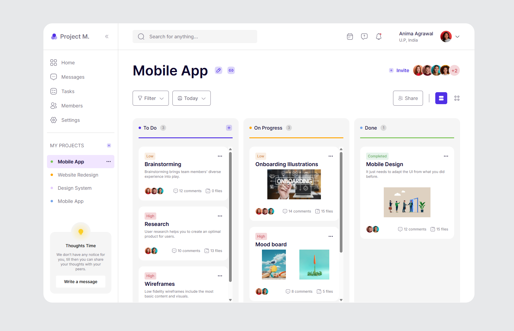

## Kanban Board

Custom Kanban board with drag-&-drop features

This is a [Next.js](https://nextjs.org) project bootstrapped with [`create-next-app`](https://nextjs.org/docs/app/api-reference/cli/create-next-app).

## Getting Started

First, run the development server:

```bash
npm run dev
# or
yarn dev
```

Open [http://localhost:3000](http://localhost:3000) with your browser to see the result.

## Task 2
### 🛠 Tech Stack

- Next.Js + TypeScript
- @dnd-kit/core
- React context

## Preview

The UI follows Figma wireframe shared in the project file.

### Result

